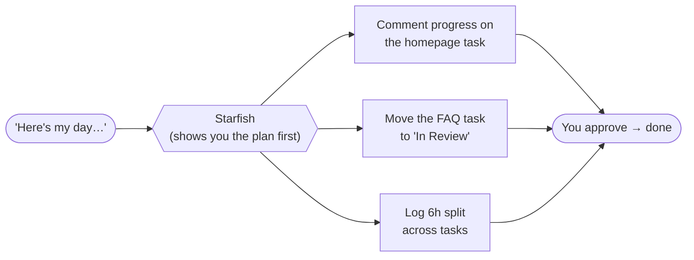

# Track 4 · ClickUp Management

> For everyone who lives in ClickUp. Stop clicking around — just ask.

## What changes for you

ClickUp is where the work lives, but managing it is a lot of clicking: open the task, find the comment box, type the update, switch to the timer, log your hours, repeat. Across a day, that's a real tax.

With Starfish connected to ClickUp, you do all of it by **asking in plain English**: "what's due this week?", "comment on the homepage task that it's ready for review," "log 2 hours on it." The assistant does the clicking.

| The old way | The Starfish way |
|-------------|------------------|
| Open ClickUp, filter, scan | "What are my tasks due this week?" |
| Click task → comment box → type | "Add a comment on task X: …" |
| Find timer, start, remember to stop | "Start a timer on task X" / "log 2 hours" |
| Click New Task, fill the form | "Create a task in [list] called …" |

::: warning Writing to ClickUp asks first
Reading your tasks is instant. Anything that **changes** ClickUp — posting a comment, logging time, creating a task — shows a permission prompt first. Read it, click **Allow**. Nothing is posted without your say-so. ([Permissions & Safety](/chat/permissions).)
:::

## Turn ClickUp on for the chat

1. Confirm ClickUp is **Connected** under **Settings → Integrations** (see [Before You Start](./before-you-start)).
2. In the chat box, open the **Apps** dropdown and switch **ClickUp** on for this conversation. (This tells the assistant it's allowed to use ClickUp.)

---

## Walkthrough 1 · See your work

**Goal:** get your tasks without opening ClickUp.

Try these, one at a time:

```
What tasks are assigned to me and due this week?
```
```
Show me everything in the "Website Redesign" list that isn't done yet.
```
```
What's overdue across all my tasks?
```

**Tip:** it sees exactly what *your* ClickUp account can see — same permissions as when you log in normally.

---

## Walkthrough 2 · Post an update as a comment

**Goal:** push a status update without leaving the chat.

```
On the "Homepage redesign" task, add a comment: "Finished the new hero
section and testimonials. Ready for review — published to the staging URL."
```

You'll get a permission prompt (posting a comment changes ClickUp). Read it, click **Allow**.

---

## Walkthrough 3 · Track your time

**Goal:** log time without hunting for the timer.

Start and stop a live timer:

```
Start a timer on the "Homepage redesign" task.
```
```
Stop my timer.
```

Or log time after the fact:

```
Log 2 hours on the "Homepage redesign" task for today, note: "hero + testimonials".
```

---

## Walkthrough 4 · Create and assign tasks

**Goal:** spin up a task in seconds.

```
Create a task in the "Website Redesign" list called "Add cookie banner to
client site", set it due Friday, and assign it to me.
```

You can also update existing ones:

```
Move the "Homepage redesign" task to "In Review" and add the tag "needs-QA".
```

---

## Walkthrough 5 · Your end-of-day routine

**Goal:** wrap up the day in one message.



This is where it really saves time. Try:

```
Here's what I did today: finished the homepage hero and testimonials,
started the FAQ section, and reviewed two client edits.

Update my ClickUp tasks to match: comment the progress on each relevant
task, mark the homepage one as "In Review", and log 6 hours split across
them sensibly. Show me your plan before you post anything.
```

Because you asked it to **show its plan first**, it lists what it'll do; you check, then say "go ahead" and approve the prompts.

::: tip "Show me your plan first" is your friend
For anything that touches several tasks at once, add "show me your plan before you post anything." You get to review the whole batch before a single change happens.
:::

---

## Try it yourself

Use your own real tasks (these are safe, reversible actions):

- [ ] Turn ClickUp on via the **Apps** dropdown
- [ ] Ask for your tasks due this week
- [ ] Post a comment update on one real task
- [ ] Log time on a task (timer or after-the-fact)
- [ ] Create a new task with a due date and assignee
- [ ] Do an end-of-day wrap-up with "show me your plan first"

## Tips & gotchas

- **Name things clearly.** Refer to tasks and lists by their real names ("the Homepage redesign task in the Website Redesign list") so it finds the right one.
- **Read the prompt before allowing.** Especially for batch updates — confirm the plan first.
- **It only sees what you see.** Your ClickUp permissions still apply.
- **Bundle your day.** One message can fetch, comment, and log time across several tasks — much faster than doing each by hand.
- **Tone too stiff?** Different AI models word updates differently. If a status comment reads too formal or too casual, switch the **model dropdown** (Claude / GPT / Gemini) and regenerate it before posting.

**See also:** [ClickUp integration](/integrations/clickup) · [Permissions & Safety](/chat/permissions) · [Using Chat](/chat/using-chat)
