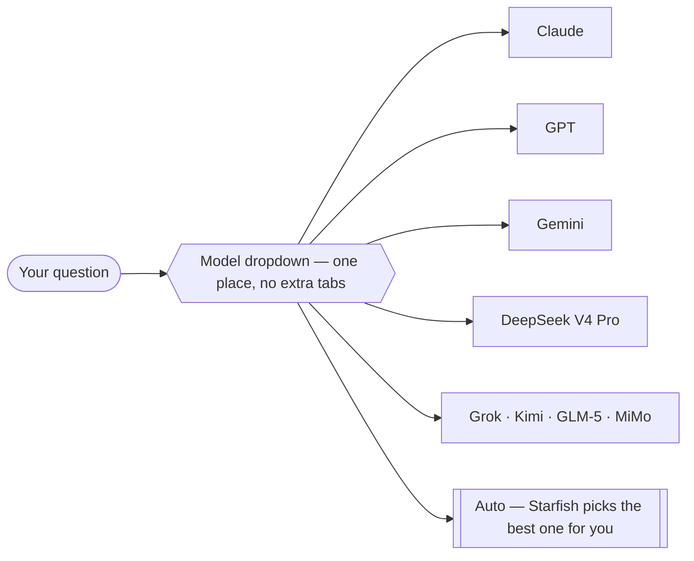

# Starfish Training — Team Playbook

Welcome. This is a hands-on guide for the Starfish Ad Age team to learn the **Starfish app** by doing real work with it — the work you already do every day, just faster.

You don't need to be technical. Every step here is "click this, type this, watch this happen." If you can write a message to a colleague, you can do everything in this book.

::: tip This book is temporary
It's a training companion for our session, kept out of the main docs menu on purpose. We'll delete it once everyone's up to speed. The "real" product documentation lives in the main menu and we link to it whenever you want more detail.
:::

## How to use this book (about 1 hour)

1. **Read your track once** (10–15 min) while I walk through it live.
2. **Do the "Try it yourself" checklist** at the end of your track (20–30 min) on your own machine.
3. **Keep this open** as a reference while you work for the next few days.

You only need to read the track(s) for **your** role. Pick yours below.

## Pick your track

| Your role | Your track | What you'll learn |
|-----------|-----------|-------------------|
| You build client websites | [**Website Development**](./website-team) | Move from WordPress/Framer to code-based sites — without writing code yourself |
| You produce social media posts | [**Social Media Production**](./social-media-production) | Turn an approved idea into a finished-looking post using image generation |
| You come up with post ideas | [**Ideation Agent**](./ideation-agent) | Build your own AI assistant that pulls *current* trends instead of generic ideas |
| You manage work in ClickUp | [**ClickUp Management**](./clickup-workflows) | Fetch tasks, post updates, and track time by just asking |

Most people will use **more than one** track. Read them in any order.

## Before you start

Everyone should do the 5-minute setup first: **[Before You Start →](./before-you-start)**

## The big idea

Today you bounce between a lot of tools — Canva, Figma, WordPress, ClickUp, your browser, your email. Starfish puts **one assistant** in front of all of them. You describe what you want in plain English, and it does the work using the tools we've connected for you.

It's not a chatbot that just talks. It actually *does things*: edits a website, designs an image, posts a comment in ClickUp, researches the web. You stay in control the whole time — it asks your permission before it changes or sends anything.

## One place. Every model.

Here's something you're probably doing right now: when you want the *best* answer, you bounce between **ChatGPT**, **Claude**, and **Gemini** — three tabs, three logins — pasting the same question into each to see who does it best.

Starfish puts **all of them behind one dropdown** in the chat box. Ask once. Not happy with the answer? Switch to a different model and ask again — *same conversation, no copy-paste.* Or leave it on **Auto** and let Starfish pick the best model for each message.

Quick guide to who's good at what:

| Provider | In Starfish | Reach for it when… |
|----------|-------------|--------------------|
| **Claude** (Anthropic) | Sonnet 4.6 · Haiku 4.5 | Writing, tone, careful reasoning |
| **GPT** (OpenAI) | 5.5 · 5.4 · Mini | General tasks, structured output |
| **Gemini** (Google) | 3.1 Pro · 3 Flash | Fast answers, big documents, images |
| **DeepSeek** | V4 Pro | A strong all-rounder — a solid default for most tasks |
| **Others** | Grok · Kimi · GLM-5 · MiMo | A second opinion / specialty takes |

You'll find the **model dropdown** at the bottom of the chat box. It remembers your choice per conversation. *(Full lineup: [Models & Providers](/chat/models) · how Auto chooses: [Auto Model Routing](/chat/auto-routing).)*

::: tip This shows up in every track
Any time an answer isn't quite right, your first move is: **switch the model and try again** — right there, no new tab. We'll point this out as you go.
:::

## Three things that make this safe (read this!)

You can experiment freely. Here's why you won't break anything:

1. **It asks before it acts.** Any time Starfish is about to change, delete, or send something, you get a prompt. Read it, then click **Allow** or **Deny**. Nothing irreversible happens without your click. *(More: [Permissions & Safety](/chat/permissions).)*
2. **Most things are undoable.** File edits show an **Undo** button. Website changes are saved in version history. A bad image just means you generate another one.
3. **When in doubt, ask the assistant.** Type "what will this do?" or "show me before you change anything." It will explain itself.

> **Rule of thumb for the whole team:** if a prompt is **red**, it's something destructive (deleting, overwriting, sending a message) — slow down and read it. If it's **amber/yellow**, it's routine (creating or reading something) — usually safe to allow.

Ready? Start with **[Before You Start →](./before-you-start)**, then jump to your track.
