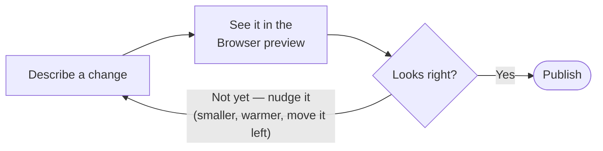

# Track 1 · Website Development

> For the team that builds client websites. No coding required from you.

## What changes for you

Until now you've built sites in **WordPress** or **Framer** — drag a block, click a setting, hit publish. We're moving clients onto **code-based websites** (faster, cheaper to host, fully ours). That normally means "you need a developer for every little change."

With Starfish, **you** make the everyday changes by *describing* them. You say "make the headline bigger and change it to X," the assistant edits the site's code, and you see the result in a preview right inside the app. When it looks good, you publish — and the live site updates.

Think of it like this:

| The old way (WordPress/Framer) | The Starfish way |
|--------------------------------|------------------|
| Log into the site builder | Open the project in Starfish |
| Click around to find the block | Tell the assistant what you want changed |
| Drag/edit by hand | The assistant edits it for you |
| Hit "Publish" | Say "publish this" → it goes live |

::: tip Who sets up the project?
A developer creates the website project and connects it the first time. **Your job is the day-to-day**: copy changes, images, colors, new sections, and publishing. If something needs a brand-new complex feature, that's when you loop in a developer.
:::

You'll use two things a lot:

- **The chat** — where you ask for changes.
- **The Browser panel** — the preview window on the right where you *see* the site. ([More on the browser](/tools/browser).)

Here's the everyday loop you'll fall into:



::: tip Stuck on a tricky change? Switch models.
Most edits land first try. If one model keeps misreading a fiddly layout request, switch the **model dropdown** at the bottom of the chat (Claude / GPT / Gemini) and ask again — same conversation, no new tab. Different models are strong at different things.
:::

---

## Walkthrough 1 · Open a site and see it live

**Goal:** open a client's website project and get a live preview on screen.

1. Open the website project in Starfish (your developer will have set this up — it appears in your workspace).
2. In the chat, type:

   ```
   Start the website preview and open it in the browser panel so I can see the homepage.
   ```

3. Starfish will run a couple of setup steps. You'll see **permission prompts** — these are normal for websites. Read them and click **Allow**.
4. The **Browser panel** opens on the right showing the live homepage.


**What you'll see:** the real website, live, inside Starfish. As you make changes, this preview updates so you can check your work before anything goes public.

---

## Walkthrough 2 · Change some words

**Goal:** edit text on a page — the most common request you'll get.

1. In the chat, describe the change in plain English. Be specific about *which* text:

   ```
   On the homepage, change the big headline from "Welcome" to
   "Coffee, roasted fresh every morning." Keep the same style.
   ```

2. The assistant finds the right place and edits it. You'll see a **tool card** showing what it changed (with an **Undo** button if you don't like it).
3. Look at the **Browser panel** — the headline updates in the preview.


**Tip:** if it changed the wrong thing, just say so — "no, I meant the headline in the hero section, not the page title." It will fix it. You can also click **Undo** on the change card.

---

## Walkthrough 3 · Change how it looks

**Goal:** adjust colors, spacing, and sizing — without knowing any design code.

Describe the *look* you want, not the technical detail:

```
Make the hero section background a darker navy, make the headline larger,
and add a bit more space above and below the "Get a quote" button.
```

Check the preview. Keep nudging in plain words until it's right:

```
The navy is too dark — make it a bit lighter, and center the button.
```


**Why this is powerful:** in Framer you'd hunt through panels for the right setting. Here you just say what you see and what you want instead.

---

## Walkthrough 4 · Add a whole new section

**Goal:** add a new block to a page — like a testimonials strip or an FAQ.

```
Add a "What our customers say" section below the hero on the homepage.
Include three testimonial cards, each with a quote, a name, and a role.
Use placeholder text for now, matching the site's existing style.
```

The assistant builds the section and it appears in the preview. Then refine it:

```
Make it two columns on desktop, and use our brand's accent color for the names.
```


**Tip:** for bigger requests like this, you can use **Plan New Idea** (a pill below the chat box) to have the assistant outline what it'll do *before* it does it. ([Plan Mode](/chat/plan-mode).)

---

## Walkthrough 5 · Publish it (make it live)

**Goal:** push your changes so the real, public website updates.

When the preview looks right, publish:

```
Save these changes and publish them to the live site.
```

What happens:

1. Starfish **saves your changes to the project's history** (so we can always roll back). You'll see a permission prompt — **Allow**.
2. It **pushes the update to GitHub** (where the site's code lives). Another **Allow**.
3. The live site **rebuilds and updates automatically**, usually within a minute or two.


::: tip Preview first, always
Get into the habit of checking the **Browser panel** before you publish. Preview = private, just for you. Publish = public, the client sees it.
:::

For the full picture of how the code/GitHub side works, see [GitHub integration](/integrations/github).

---

## Try it yourself

Use a **practice/staging site** (ask before touching a real client site). Tick these off:

- [ ] Open a site and get the preview showing in the Browser panel
- [ ] Change a headline, then **Undo** it, then change it again and keep it
- [ ] Change a background color and a button size by describing the look
- [ ] Add a new section (testimonials, FAQ, or a call-to-action band)
- [ ] Replace an image (drag a new image into the chat and say "use this in the hero")
- [ ] Publish to the staging site and confirm the live URL updated

## Tips & gotchas

- **Be specific about *where*.** "The headline" is vague if there are several. Say "the hero headline on the homepage."
- **It's a conversation.** You rarely get it perfect in one prompt. Nudge it: "smaller", "more spacing", "move it left."
- **You can't silently break the live site.** Changes only go public when you say "publish" and click Allow. Previews are private.
- **Know your limit.** Everyday content, styling, images, sections = you. Brand-new interactive features, payment forms, integrations = loop in a developer.
- **When unsure, ask the assistant** "what will this change?" before allowing.

**See also:** [Embedded Browser](/tools/browser) · [GitHub](/integrations/github) · [Permissions & Safety](/chat/permissions) · [Plan Mode](/chat/plan-mode)
